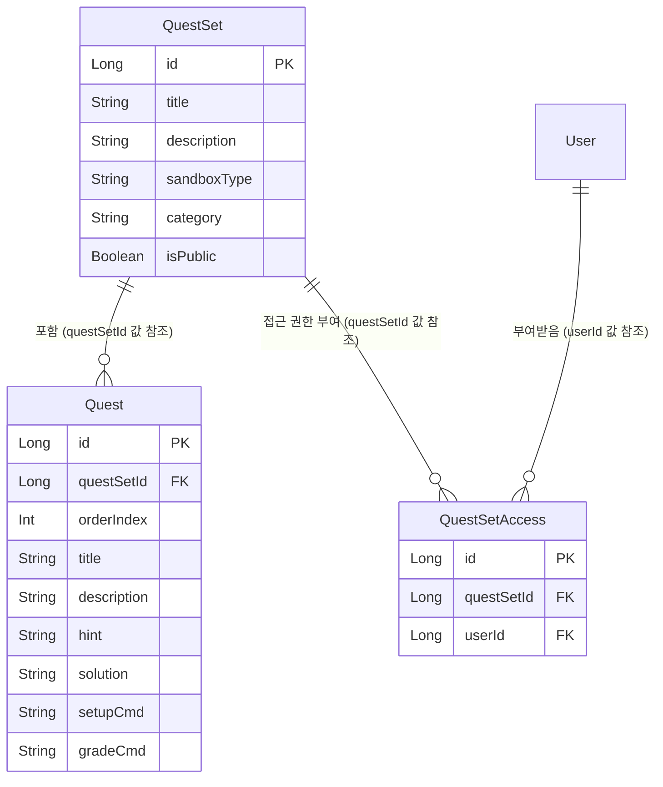

# 도메인모델 — quest

`quest` 도메인(퀘스트셋/퀘스트/접근 권한)의 애그리게잇을 속성/행위/규칙으로 정리한다. 용어는
[용어사전.md](용어사전.md) 기준을 따른다.

**적용 범위**: splearn 분석에서 착안한 문서화 방식을 우선 `quest` 도메인에 시범 도입한다. `auth`,
`user` 도메인은 다음에 새로 설계하는 애그리게잇부터 자연스럽게 확장한다 (근거:
[reference_projects_action_items.md 2-2](../research/reference_projects_action_items.md)).

**코드-문서 연결**: 이 문서와 실제 코드가 어긋나면 코드를 기준으로 이 문서를 갱신한다 (CLAUDE.md
"문서와 코드가 어긋나면 문서가 기준이다"는 원칙은 *구현 전* 명세에 해당하고, 이미 구현된 도메인
모델은 코드가 실제 동작의 근거이므로 이 문서가 코드를 따라간다).

---

## `QuestSet` (Aggregate Root)

실습 주제 하나를 묶는 단위. `Quest`, `QuestSetAccess`는 `QuestSet`을 값(ID)으로만 참조하고
JPA 객체 참조(`@OneToMany` 등)를 쓰지 않는다 — 세 엔티티가 항상 같은 트랜잭션에서 함께 갱신될
필요가 없기 때문 (근거: [cafekiosk_analysis.md 2](../research/cafekiosk_analysis.md)의
`Stock ↔ Product` 결정과 동일 기준).

**속성** (`domain/quest/QuestSet.kt`)

| 필드 | 타입 | 설명 |
|---|---|---|
| id | Long | `BaseEntity`가 제공하는 PK |
| title | String | 퀘스트셋 제목 |
| description | String? | 설명 |
| sandboxType | String | 실습에 쓰일 샌드박스 종류 |
| category | String | 분류 |
| isPublic | Boolean | 공개 여부(기본값 `true`), `changePublic()`으로만 변경 |
| createdAt | LocalDateTime | `BaseEntity`가 제공 |

**행위**

- `changePublic(value: Boolean)` — 공개 여부를 바꾼다. `isPublic`의 setter가 `protected`라 이
  메서드를 거치지 않고는 외부에서 값을 바꿀 수 없다.
- `toAdminSummary(accessUsers: List<UserSummary>)` — 관리자 화면용 요약(`QuestSetAdminSummary`)으로
  변환한다. 접근 권한이 부여된 사용자 목록은 `QuestSetAccess`를 통해 조회한 뒤 파라미터로 받는다 —
  `QuestSet` 자신은 자신에게 접근 권한이 있는 사용자를 조회할 방법을 모른다 (그건
  `QuestService`/`QuestSetAccessRepository`의 책임).

**규칙**

- 공개(`isPublic = true`) 퀘스트셋은 모든 로그인 사용자가 접근할 수 있다.
- 비공개 퀘스트셋은 관리자이거나 `QuestSetAccess`로 개별 권한을 받은 사용자만 접근할 수 있다
  (`QuestService.canAccess`가 판단 — `QuestSet` 자체에는 이 규칙이 없다. `QuestSet`은 자신의
  공개 여부만 알고, "누가 접근 가능한가"는 `QuestSetAccess`와 역할(role) 정보까지 조합해야
  판단할 수 있어 서비스 레이어의 책임으로 둔다).

## `Quest`

퀘스트셋에 속한 개별 실습 문제. `questSetId`로 `QuestSet`을 참조한다.

**속성** (`domain/quest/Quest.kt`)

| 필드 | 타입 | 설명 |
|---|---|---|
| id | Long | `BaseEntity`가 제공하는 PK |
| questSetId | Long | 소속 `QuestSet`의 ID (값 참조) |
| orderIndex | Int | 퀘스트셋 안에서의 순서(기본값 0) |
| title | String | 제목 |
| description | String | 설명 |
| hint | String? | 힌트 |
| solution | String? | 정답 |
| setupCmd | String? | 샌드박스 초기화 명령(JSON) |
| gradeCmd | String | 채점 명령(JSON, 필수) |
| createdAt | LocalDateTime | `BaseEntity`가 제공 |

**행위**

- 현재 `Quest` 자체에는 상태를 바꾸는 메서드가 없다 — 생성 후 불변인 값 객체에 가깝다. 모든 필드가
  `val`이고, 조회 전용으로만 쓰인다 (`QuestService.getQuests`).

**규칙**

- `gradeCmd`는 채점 전용이라 조회 API 응답(`QuestSummary`)에는 포함하지 않는다
  (`QuestService.getQuests`의 `QuestSummary` 매핑 참고).
- 같은 `questSetId`를 가진 퀘스트들은 `orderIndex` 오름차순으로 노출된다
  (`QuestRepository.findAllByQuestSetIdOrderByOrderIndex`).

## `QuestSetAccess`

특정 사용자가 특정 비공개 퀘스트셋에 접근할 수 있다는 사실 하나만 표현하는 엔티티. `QuestSet`,
`User` 둘 다 ID(`questSetId`, `userId`)로만 참조한다.

**속성** (`domain/quest/QuestSetAccess.kt`)

| 필드 | 타입 | 설명 |
|---|---|---|
| id | Long | `BaseEntity`가 제공하는 PK |
| questSetId | Long | 대상 `QuestSet`의 ID |
| userId | Long | 접근 권한을 받은 사용자의 ID |
| createdAt | LocalDateTime | `BaseEntity`가 제공 |

**행위**

- 없음 — 존재 자체가 "권한이 있다"는 사실을 나타내는 순수한 관계 레코드다. 생성(`grantAccess`)과
  삭제(`revokeAccess`)만 `QuestService`를 통해 이루어진다.

**규칙**

- `(quest_set_id, user_id)` 조합은 유일해야 한다(DB `UNIQUE` 제약, `00_schema.sql`). 이미 권한이
  있는 조합에 다시 권한을 부여하면 `QuestService.grantAccess`가 아무 것도 하지 않고 반환한다
  (`existsByQuestSetIdAndUserId`로 먼저 확인).

---

## 관계 다이어그램

화살표가 실제 JPA 연관관계(`@ManyToOne` 등)가 아니라 **값으로만 연결된 참조**라는 점이 이
다이어그램에서 가장 중요한 정보다 — FK 제약은 DB 스키마 레벨에는 있어도(`00_schema.sql`), 엔티티
객체 사이에는 없다.
